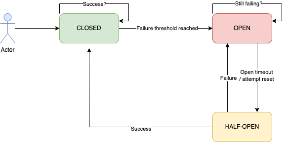

# Circuit Breaker

Implements [circuit-breaker pattern][link-pattern] with [Golang][link-go]

Inpsired by [sony/gobreaker][link-inspired]

## Dependencies

- [Go][link-go] 1.19 or higher
- [Make][link-make]

## Architecture



## Example

```go
func main() {
    config := circuit_breaker.Config{
		Name: "Circuit Breaker",
		ReadyToTrip: func(counts circuit_breaker.Counts) bool {
			failureRatio := float64(counts.TotalFailures) / float64(counts.Requests)
			return counts.Requests >= 3 && failureRatio >= 0.7
		},
		OnStateChange: func(name string, from, to circuit_breaker.State) {
			fmt.Printf("%s: state changed from %s to %s", name, from, to)
		},
	}

    cb := circuit_breaker.NewCircuitBreaker(config)

    msg, err := cb.Execute(func() (interface{}, error) {
	// your actual service call here...
    })
}
```

See [example][link-example] for details.

## License

MIT. Please see the [license file](LICENSE.md) for more information.

[link-go]: https://go.dev/
[link-make]: https://www.gnu.org/software/make/manual/make.html
[link-inspired]: https://github.com/sony/gobreaker/
[link-example]: https://github.com/shirokovnv/circuit_breaker/example/main.go
[link-pattern]: https://microservices.io/patterns/reliability/circuit-breaker.html
